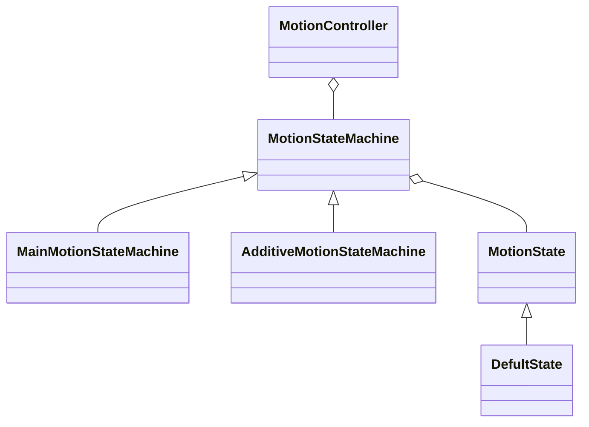

# ProJect-Moon
ProJect-Moon development team

The code naming convention for this project is as follows：

- Class                                                          Robot
- Interface                                                   IEat
- Private Attribute                                     m_robotSpeed
- Public Attribute                                       RobotSpeed
- Enum Class                                              ROBOT_TYPE
- Local Parameter                                      robotSpeed


The code method parenthesis specification for this project is as follows：

- ```
  public void Motion()
  {
      foreach (var motionState in m_playerMoveStates)
      {
          motionState.Motion();
      }
  }
  ```


The existing architecture class diagram for this project is as follows：


MotionController


