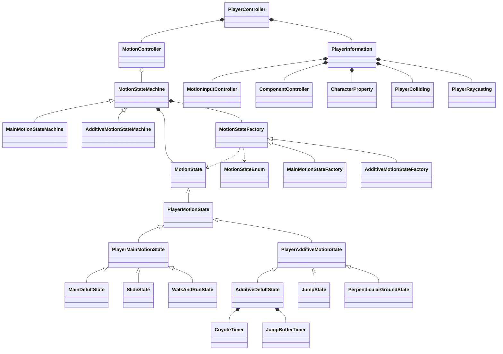
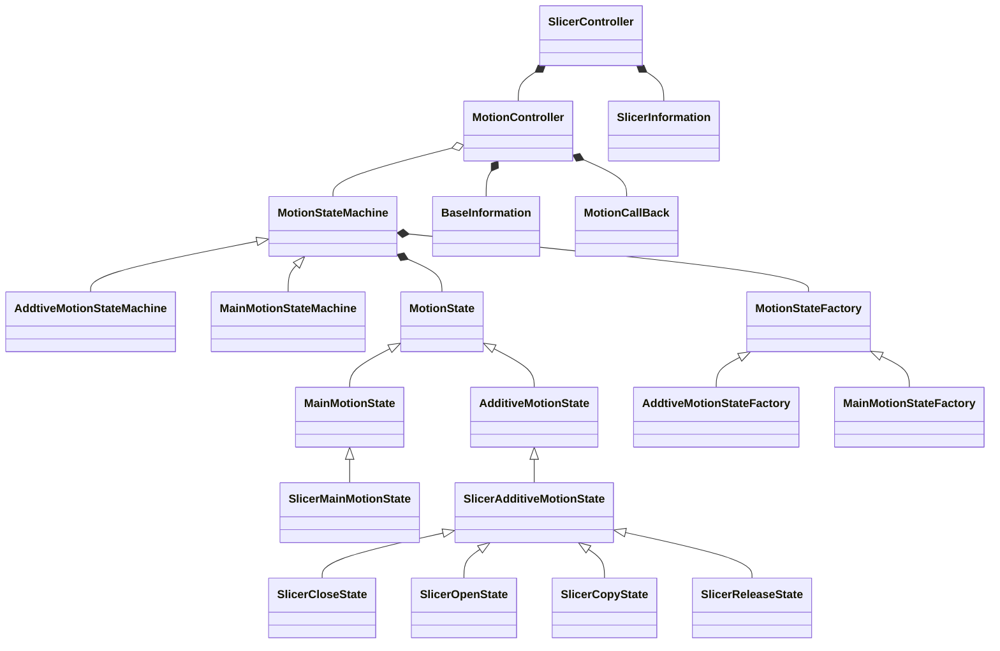

<h3 align="center">
  
</h3>

# ProJect-Moon

ProJect-Moon development team.

[](https://space.bilibili.com/165762441)


## TODO

- [x] Build the basic framework and design the coding style.
- [x] Multi-parameter player controller.
- [x] Polygoncollider2D needs to be generated from the mesh, and concave polygons need to be supported.
- [x] Accurate clipping, and the minimum number of game objects mounted.
- [ ] The camera controller, based on Cinemachine cameras, requires enough pithy.
- [ ] The AI of game NPCS requires high scalability and state-based production.
- [ ] Optimal handling of physical collisions in which multiple objects physically form an assembly.
- [ ] It can detect complex physical collisions without using rigid body components.
- [ ] Portal, Total War Simulator like level editor, edit the level while the game is running.

## Project milestone

- The algorithm of generating polygoncollider2D mesh based on mesh triangle is completed, and the performance is good, and it supports concave polygon. 

  - The core idea of the algorithm is to find all triangles according to mesh and make them two-dimensional, and remove redundant, intersecting triangles and vertices that do not form a triangle. Finally, a greedy algorithm is used to generate polygoncollider2D. I am glad that Unity mesh models are already triangulated, which saves me a lot of trouble.

    <p align="right">——2023.9.11</p>

<h3 align="center">
  
</h3>

- Very accurate slicer box, and the parameters are very concise, the code logic is good.

  - Based on Ezy-Slice. A slicer box is generated based on some mathematical and linear algebra calculations, and the object pool framework is used. So far, slicer box is working very well.

    <p align="right">——2023.9.16</p>

<h3 align="center">
  
</h3>

## Project structure

**The code naming convention for this project is as follows：**

|        Type         |     Name     |
| :-----------------: | :----------: |
|        Class        |    Robot     |
|      Interface      |     IEat     |
|  Private Attribute  | m_robotSpeed |
|  Public Attribute   |  RobotSpeed  |
| Protected Attribute | m_robotSpeed |
|     Enum Class      |  ROBOT_TYPE  |
|   Local Parameter   |  robotSpeed  |

------

**The code method parenthesis specification for this project is as follows：**

- ```c#
  public void Motion()
  {
      foreach (var motionState in m_playerMoveStates)
      {
          motionState.Motion();
      }
  }
  ```

------

**The custom structs for this project are as follows:**

Structs

- Custom data structures to make the code clearer.
  - TrianglePoints:  The triangle struct, which contains three Vector2 vertices, simulates a triangle and has a static extension method for it.
  - InputProperty:  A GENERIC structure THAT stores the input, used to get and set the input, and can get the start input instant, the cancel input instant, and the input status.


------

**The existing architecture class diagram for this project is as follows：**

StaticExtensions

- These static classes provide methods that other classes extend statically.
  - Now service classes are: LayerMask, MotionState,Raycast, Rigidbody, Vector2 / Vector3,TrianglePoints,Mesh,Transform,CharacterProperty.


Singleton

- A class that inherits from a singleton and acts as a manager for some underlying in-game functionality.
  - EventManager is the event manager responsible for managing all global events in the game.
  - InputManager is the input manager and is responsible for detecting all inputs from the player.
  - ObjectPool is the global object pool for the game. It primarily manages the pool of instantiated objects from prefabricated ones.


MotionController

- A state controller designed with state mode and factory mode is used.
  - The state machine is MotionStateMachine
  - The state is MotionState
  - The factory is MotionStateFactory
  - The data is BaseInformation


PlayerController



SlicerController


