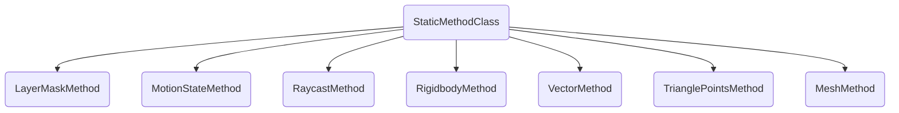

<h3 align="center">
  
</h3>

# ProJect-Moon

ProJect-Moon development team.

[](space.bilibili.com/165762441)

------


## Project milestone

- The algorithm of generating polygoncollider2D mesh based on mesh triangle is completed, and the performance is good, and it supports concave polygon. 

  - The core idea of the algorithm is to find all triangles according to mesh and make them two-dimensional, and remove redundant, intersecting triangles and vertices that do not form a triangle. Finally, a greedy algorithm is used to generate polygoncollider2D. I am glad that Unity mesh models are already triangulated, which saves me a lot of trouble.

    <p align="right">——2023.9.11</p>

<h3 align="center">
  
</h3>
------


## Project structure

**The code naming convention for this project is as follows：**

|        Type         |     Name     |
| :-----------------: | :----------: |
|        Class        |    Robot     |
|      Interface      |     IEat     |
|  Private Attribute  | m_robotSpeed |
|  Public Attribute   |  RobotSpeed  |
| Protected Attribute | m_robotSpeed |
|     Enum Class      |  ROBOT_TYPE  |
|   Local Parameter   |  robotSpeed  |

------

**The code method parenthesis specification for this project is as follows：**

- ```c#
  public void Motion()
  {
      foreach (var motionState in m_playerMoveStates)
      {
          motionState.Motion();
      }
  }
  ```


------

**The existing architecture class diagram for this project is as follows：**

StaticMethodClass

- These static classes provide methods that other classes extend statically.
  - Now service classes are: LayerMask, MotionState,Raycast, Rigidbody, Vector2 / Vector3.




Singleton

- A class that inherits from a singleton and acts as a manager for some underlying in-game functionality.
  - EventManager is the event manager responsible for managing all global events in the game.
  - InputManager is the input manager and is responsible for detecting all inputs from the player.


MotionController

- A role controller designed with state mode and factory mode is used.
  - The state machine is MotionStateMachine
  - The state is MotionState
  - The factory is MotionStateFactory
  - The data is PlayerInformation


