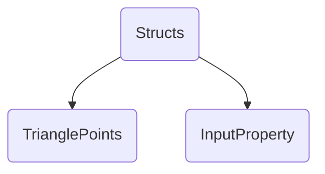
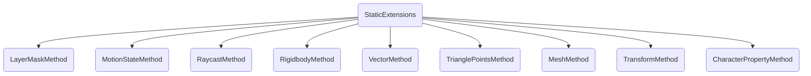
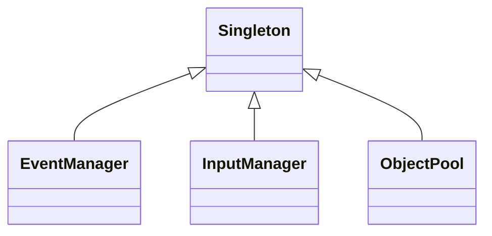
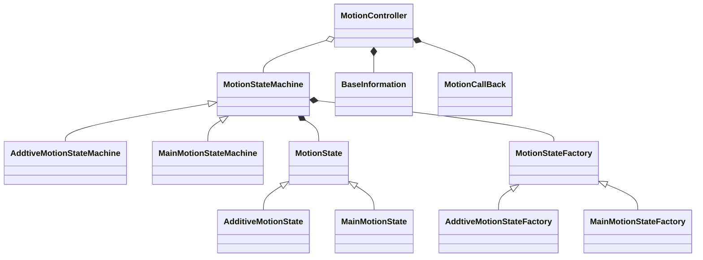
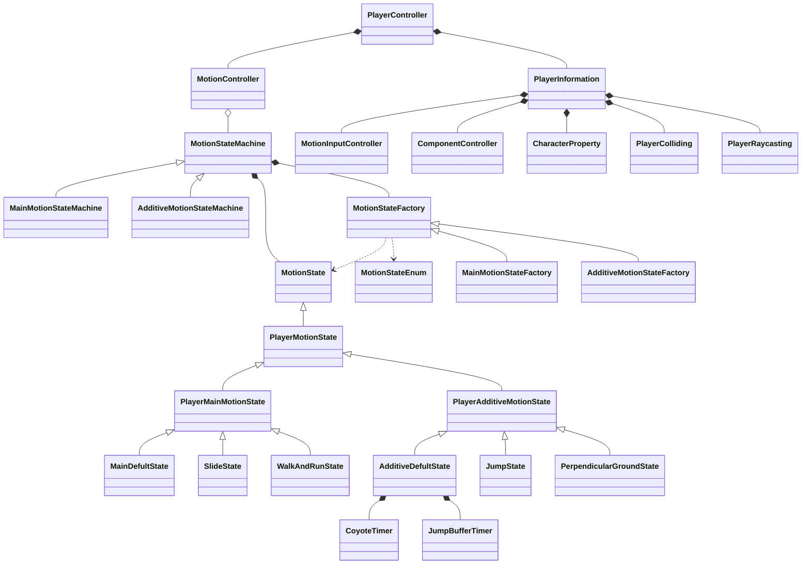
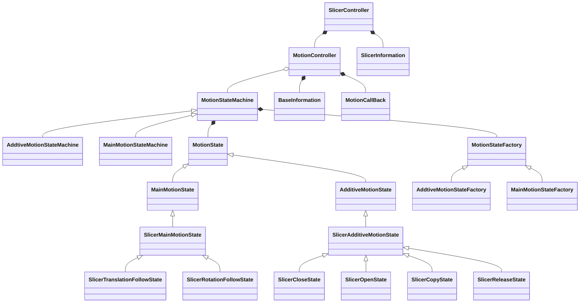
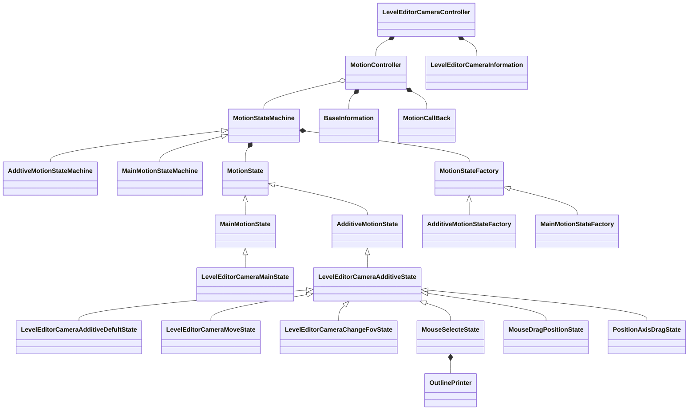
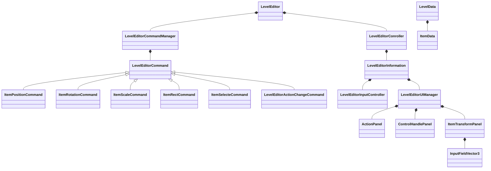

# The custom structs for this project are as follows

Structs

- Custom data structures to make the code clearer.
  - TrianglePoints:  The triangle struct, which contains three Vector2 vertices, simulates a triangle and has a static extension method for it.
  - InputProperty:  A GENERIC structure THAT stores the input, used to get and set the input, and can get the start input instant, the cancel input instant, and the input status.

------

**The existing architecture class diagram for this project is as follows：**

## StaticExtensions

- These static classes provide methods that other classes extend statically.
  - Now service classes are: LayerMask, MotionState,Raycast, Rigidbody, Vector2 / Vector3,TrianglePoints,Mesh,Transform,CharacterProperty.

## Singleton

- A class that inherits from a singleton and acts as a manager for some underlying in-game functionality.
  - EventManager is the event manager responsible for managing all global events in the game.
  - InputManager is the input manager and is responsible for detecting all inputs from the player.
  - ObjectPool is the global object pool for the game. It primarily manages the pool of instantiated objects from prefabricated ones.

## MotionController

- A state controller designed with state mode and factory mode is used.
  - The state machine is MotionStateMachine
  - The state is MotionState
  - The factory is MotionStateFactory
  - The data is BaseInformation

## PlayerController

## SlicerController

## LevelEditorCameraController

## LevelEditor

